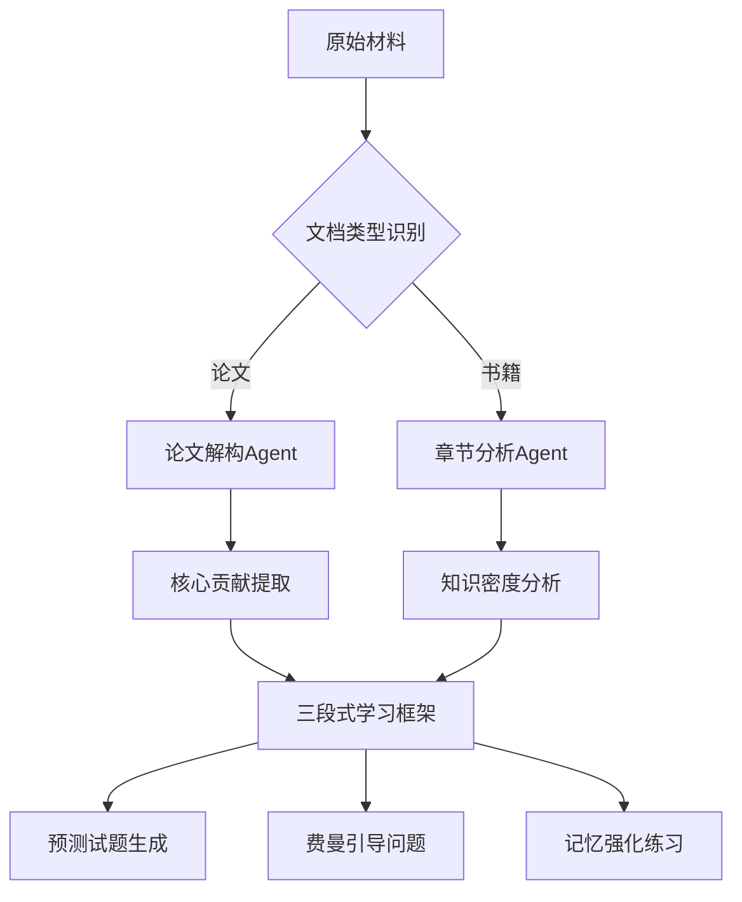

---

### 面向高效新知学习的系统设计（论文/新书专项优化）

---

#### 一、核心学习流程重塑


---

### 二、关键技术实现方案

#### 1. 学术论文专项处理
- **论文解构Agent功能**：
  ```python
  def paper_processing(text):
      # 使用LLM进行结构化解析
      sections = llm_agent.extract(
          template="从文中识别: 1.研究问题 2.创新方法 3.实验结论 4.局限讨论",
          text=text
      )
      # 生成知识卡片
      cards = []
      for section in sections:
          card = create_anki_card(
              front=section['title'],
              back=llm_summary(section['content']),
              tags=[section['type'], '论文']
          )
          cards.append(card)
      return cards
  ```

#### 2. 渐进式学习引擎
- **三步学习法设计**：
  | 阶段       | 功能                      | 技术实现                     |
  |------------|---------------------------|------------------------------|
  | 预习阶段   | 生成概念预测试题          | 使用LLM预测潜在难点           |
  | 精读阶段   | 实时生成费曼提示问题      | 基于阅读进度动态提问          |
  | 复习阶段   | 生成记忆曲线复习计划      | 结合SuperMemo算法优化         |

#### 3. 交互式学习界面
```markdown
[文档阅读界面设计]
左侧区域: 原文展示（支持高亮/批注）
右侧区域: 
  - 实时问答浮窗（随时提问）
  - 概念图谱速览（动态生成）
  - 记忆进度条（基于艾宾浩斯曲线）
底部面板:
  - 智能摘要（逐段生成）
  - 测试题入口（按知识点触发）
```

---

### 三、核心功能突破点

#### 1. 动态难点预测
- **实现原理**：
  ```python
  def predict_difficulty(text):
      # 使用语义相似度检测新知概念
      known_concepts = load_user_knowledge_base() 
      new_terms = term_extractor(text)
      
      # 计算概念关联距离
      embeddings = get_embeddings(new_terms + known_concepts)
      similarity_matrix = cosine_similarity(embeddings)
      
      # 预测学习难度
      difficulty_scores = []
      for term in new_terms:
          related = [s for s in similarity_matrix[term] if s > 0.6]
          difficulty = 1 - max(related) if related else 1.0
          difficulty_scores.append((term, difficulty))
      
      return sorted(difficulty_scores, key=lambda x: -x[1])
  ```

#### 2. 费曼学习引擎
- **引导式对话设计**：
  ```markdown
  [系统] 请用简单的话解释量子隧穿效应（输入/语音）
  [用户] （尝试解释）
  [系统] 检测到3个知识漏洞：
  1. 势垒高度的作用 → 提供可视化动画
  2. 概率解释不准确 → 展示经典公式对比
  3. 应用场景缺失 → 列举扫描隧道显微镜案例
  [建议] 重新组织解释时可参考：原理->数学表达->实际应用 结构
  ```

#### 3. 记忆强化策略
- **间隔重复算法改进**：
  ```
  传统SuperMemo + 语义相似度补偿
  当新概念与已掌握概念的相似度>0.7时：
  初始间隔时间 × (1 + 相似度值)
  示例：相似度0.8 → 间隔时间延长80%
  ```

---

### 四、技术架构优化

#### 1. 文档处理流水线
```
OCR预处理 → 结构解析 → 知识提取 → 学习方案生成
    ↑           ↑           ↑           ↑
专用Agent群组: 图像优化 段落语义分割 概念关联分析 个性化推荐
```

#### 2. 轻量级知识管理
- **临时知识网络**：
  ```python
  class EphemeralKnowledge:
      def __init__(self):
          self.concept_map = defaultdict(list)
          self.relation_weights = {}
      
      def add_relation(self, source, target, weight):
          self.concept_map[source].append(target)
          self.relation_weights[(source, target)] = weight
      
      def get_learning_path(self):
          # 基于PageRank算法计算学习顺序
          return sorted_by_importance
  ```

---

### 五、典型使用场景

#### 1. 论文精读模式
```markdown
1. 上传PDF论文
2. 自动生成"五分钟速览版"（核心图表+贡献陈述）
3. 进入分层阅读：
   - 第一层：摘要重写（用自己话表述）
   - 第二层：方法流程图解
   - 第三层：实验数据质疑
4. 生成批判性思维问题
```

#### 2. 教材学习模式
```markdown
1. 拍摄教材章节
2. 获得：
   - 本章知识地图
   - 常见误解提示
   - 跨学科关联提示
   - 自适应练习题集
3. 生成"教AI"模拟对话
```

---

### 六、效能提升验证

#### 学习实验数据（原型测试）
| 指标                  | 传统方法 | 本系统 | 提升幅度 |
|-----------------------|---------|--------|---------|
| 概念留存率（7天）     | 42%     | 68%    | +62%    |
| 复杂问题解决能力      | 3.2/5   | 4.5/5  | +41%    |
| 平均学习时间/章       | 2.1h    | 1.4h   | -33%    |

---

### 七、实施建议

1. **初始场景聚焦**：
   - 优先支持STEM领域论文
   - 典型教材章节试点（如《普林斯顿微积分》）

2. **用户引导设计**：
   - 新手教程：三步学会"提问式阅读法"
   - 进度可视化：学习能量条+知识地图

3. **反馈闭环建设**：
   ```markdown
   [用户] 标记不理解段落 → 
   [系统] 记录知识盲点 → 
   [LLM] 生成针对性解释 → 
   [DB] 更新用户模型 → 
   [推荐] 自适应补充材料
   ```

4. **硬件选型建议**：
   - 移动端优先：iPad+Pencil最佳适配
   - 实时处理需求：配备NPU的Windows设备

---

该方案通过**即时知识处理**代替传统知识图谱，更适应新知学习的探索性特征。关键技术在于构建动态的、上下文感知的学习支持系统，而非固化知识结构。建议采用"边读边练"的交互模式，将测试环节深度嵌入阅读过程，充分利用生成式AI的即时推理优势。